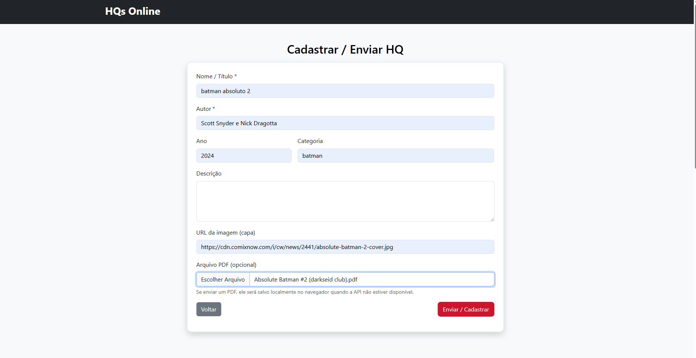
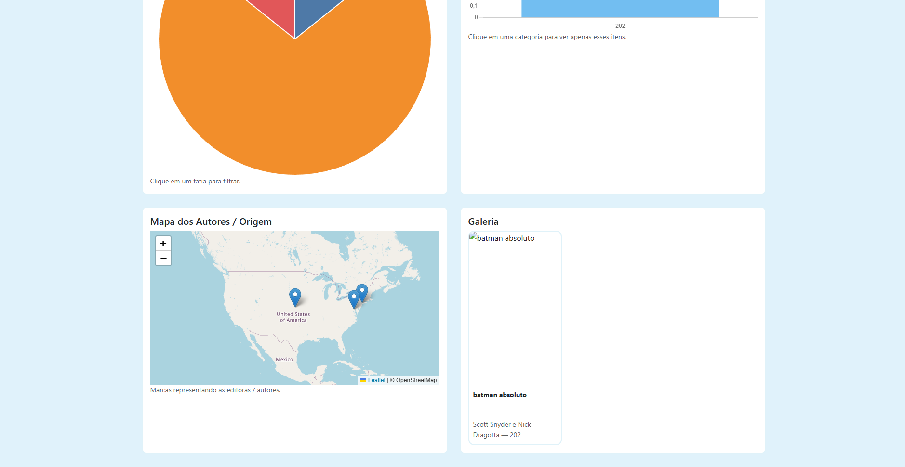

# Trabalho Prático 07 - Semanas 13 e 14

A partir dos dados cadastrados na etapa anterior, vamos trabalhar formas de apresentação que representem de forma clara e interativa as informações do seu projeto. Você poderá usar gráficos (barra, linha, pizza), mapas, calendários ou outras formas de visualização. Seu desafio é entregar uma página Web que organize, processe e exiba os dados de forma compreensível e esteticamente agradável.

Com base nos tipos de projetos escohidos, você deve propor **visualizações que estimulem a interpretação, agrupamento e exibição criativa dos dados**, trabalhando tanto a lógica quanto o design da aplicação.

Sugerimos o uso das seguintes ferramentas acessíveis: [FullCalendar](https://fullcalendar.io/), [Chart.js](https://www.chartjs.org/), [Mapbox](https://docs.mapbox.com/api/), para citar algumas.

## Informações do trabalho

- Nome:Gabriel Henrique Fernandes Vieira
- Matricula:878933
- Proposta de projeto escolhida:
- Breve descrição sobre seu projeto:

**Print da tela com a implementação**

Criei uma página de visualizações que carrega os HQs do db.json e mostra gráficos e um mapa de forma interativa. Ao clicar numa fatia do gráfico de pizza você filtra a galeria e o gráfico de barras por categoria; o mapa marca as editoras/ autores (coordenadas simples).

Principais arquivos:

visualizations.html — layout com áreas para pie, bar, mapa e galeria.
visualizations.js — busca os dados, gera os gráficos (Chart.js), o mapa (Leaflet) e controla a interação.
index.html — link no menu para acessar a nova página.

<<  COLOQUE A IMAGEM TELA 2 AQUI >>s